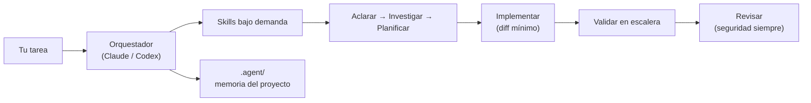
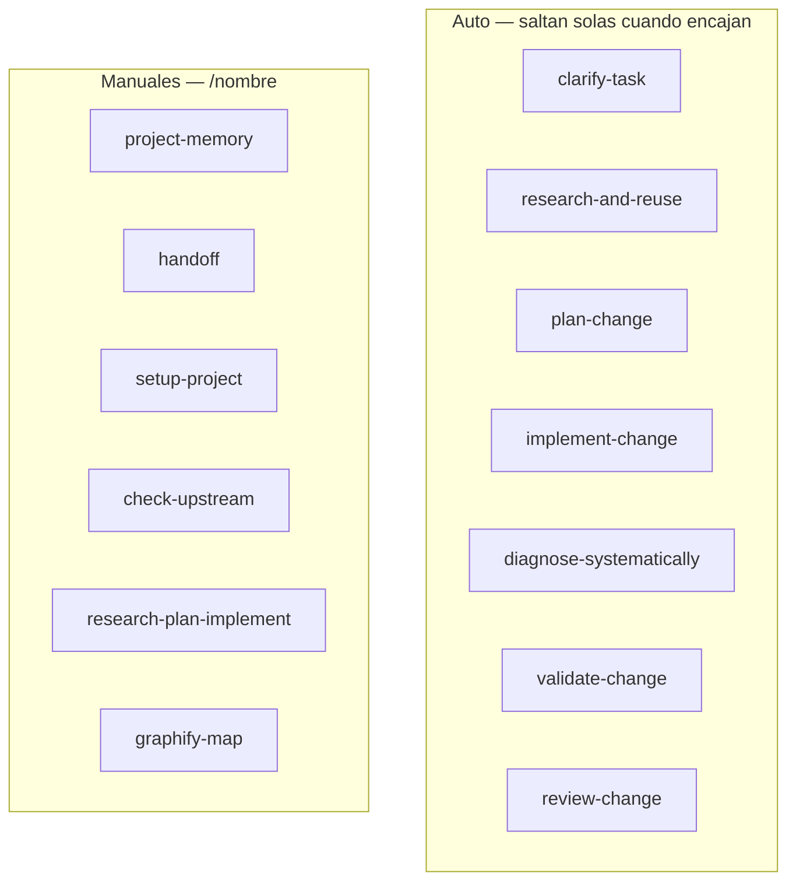
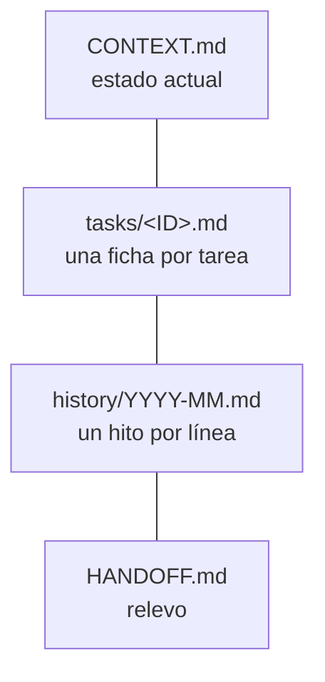

# Ritt Agent Skills

Kit **review-first** de *skills* de ingeniería para **Claude Code** y **Codex**. El agente pregunta lo justo, reutiliza antes de construir, planifica con dos opciones, implementa el diff mínimo, valida con evidencia y recuerda por proyecto. Licencia **MIT**.

> Puedes escribir los prompts en español o en inglés: el disparo de skills es semántico.

## 🧠 Cómo funciona (de un vistazo)



Las skills se cargan **solo cuando hacen falta** (estándar [Agent Skills](https://agentskills.io/specification), *progressive disclosure*): en reposo cada una ocupa ~100 tokens (nombre + descripción). Al dispararse, se lee su `SKILL.md`; los recursos pesados solo se cargan si se usan.

## 📦 Instalación

Requisitos: `git` y `python3`. No se instala nada más de forma automática.

**Opción A — enlaces locales (Claude Code y Codex):**
```bash
git clone https://github.com/Rittmeyer765/ritt-agent-skills ~/.claude/ritt-agent-skills
cd ~/.claude/ritt-agent-skills
bash scripts/link_skills.sh      # symlinks en ~/.claude/skills y ~/.agents/skills
```

**Opción B — plugin de Claude Code (marketplace):**
```text
/plugin marketplace add Rittmeyer765/ritt-agent-skills
/plugin install ritt-engineering
```

Comprueba que todo está sano:
```bash
python3 scripts/validate_repo.py     # estructura, conformidad de skills, versión
```

## 🧩 Las skills (13)



- **Aclarar / investigar / planificar / implementar / validar / revisar / diagnosticar** — el ciclo de trabajo, cada paso en su skill.
- **project-memory / handoff** — memoria y relevo entre sesiones.
- **setup-project** — instala el kit en un repo nuevo.
- **check-upstream** — avisa (nunca aplica) de novedades en las fuentes que sigue.
- **graphify-map** — opcional: navega el código con un grafo local (ver más abajo).

## 🗂️ Memoria por proyecto (`.agent/`)



Solo el orquestador escribe memoria, en hitos o en el handoff — nunca en modo AUDIT. Reglas anti-bucle (fingerprints) evitan repetir el mismo intento fallido.

## 🧭 Uso diario

1. Abre el proyecto y describe la tarea.
2. Deja que el orquestador elija la skill.
3. Usa agentes pequeños para investigar, implementar y revisar.
4. Guarda el contexto estable en `.agent/`.

Guía completa: [docs/OPERATIONS.md](docs/OPERATIONS.md).

## 🔌 Integraciones opcionales

- **Graphify** (opcional, `graphify-map`): mapa local del código con citas `file:line`. **No se instala solo** y queda fuera del PATH; útil para preguntas de dependencias cross-file. Resultado del A/B y cuándo merece la pena: [docs/benchmarks/graphify-smoke.md](docs/benchmarks/graphify-smoke.md).
- **OmniRoute** (preparado, **inactivo**): plantillas seguras para un gateway local opt-in. No se activa por defecto.

Cómo encaja cada pieza sin pisarse: [docs/INTEGRATION_MATRIX.md](docs/INTEGRATION_MATRIX.md).

## 🔒 Seguridad y permisos

- El Markdown es **guía**, no barrera: la barrera dura son los permisos, hooks y sandbox de la herramienta.
- Antes de acciones destructivas o con efectos externos (push, merge, deploy, secretos, dependencias) el agente **pide confirmación**.
- Recomendado en Claude Code: modo **Manual** (`claude --permission-mode default`) con una allowlist pequeña de solo-lectura; nunca `bypassPermissions`.

## 📄 Licencia y créditos

MIT — Copyright (c) 2026 Rittmeyer765 (ver [LICENSE](LICENSE)). Adapta ideas de [mattpocock/skills](https://github.com/mattpocock/skills) (MIT) y sigue el estándar [Agent Skills](https://agentskills.io/specification); detalles en [THIRD_PARTY_NOTICES.md](THIRD_PARTY_NOTICES.md).
